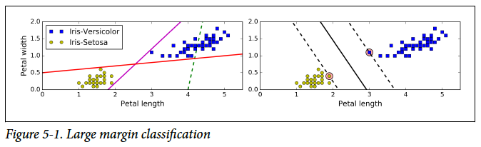

# Support Vectorm Machine (SVM) :rocket:

* SVMs are used for 
    * classification (linear and non linear)
    * regression
    * outlier detection
* An SVM classifier works by drawing a line (**decision boundary**) that stays far away from the training examples.
* An SVM classifier fits the widest possible *street* between linearly separable classes. This is called **large margin classification**.
* An SVM classifier is only affected by examples located on the edge of the street. Adding more examples off the street is not going to affect the decision boundary. The examples on the edge of the street are called **support vectors**.
* Narrow streets do not generalise well on unseen data.

In *Figure-5-1 right*, the parallel dashed lines represent the *street* while the middle solid line represents the decision boundary. The circled examples on the edge of the street i.e., on the dashed lines represent the support vectors. They are probably called support vectors because examples are characterised by a vector of features and these are the only vectors that affect the classifier or in other words, support the classifier in deciding on a decision boundary.

* SVMs are sensitive to feature scaling; the classifier provides a better decision boundary with feature scaling.
* **Hard margin classification**
   * Imposing that no example is on the street
   * Two issues
      * Only works if data is linearly separable
      * Sensitive to outliers
         * either impossible to find a hard margin (when the outlier is among the other group)
         * finds a narrow margin (when the outlier is away from its own group and close to the decision boundary) which does not generalise well
      
